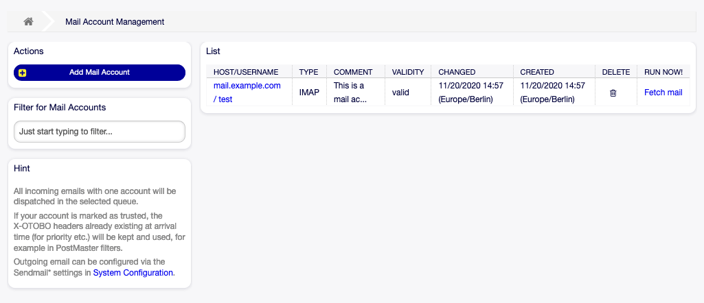
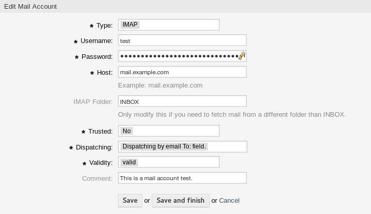
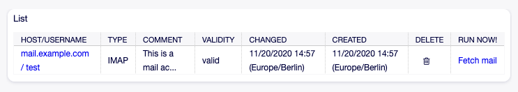
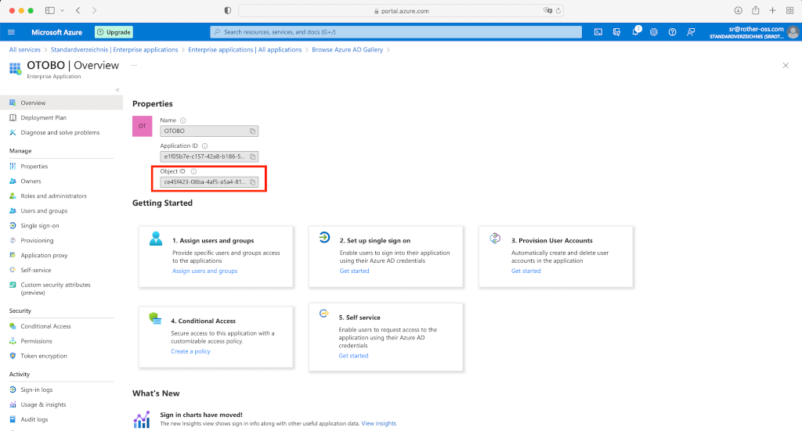
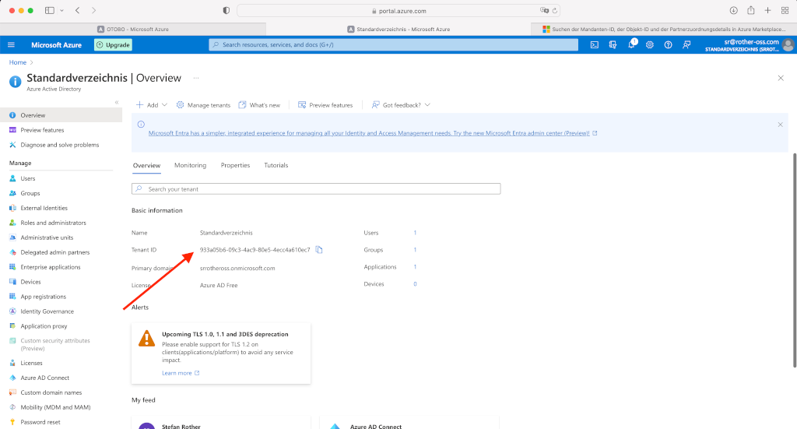
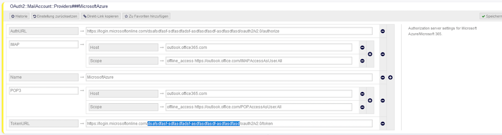
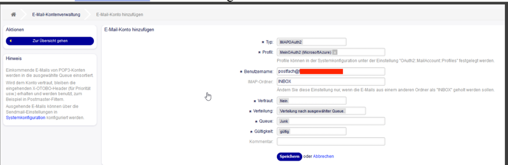

PostMaster Mail Accounts
========================

Just as a company doesn't just have one department which receives traditional mail, your service desk will also serve multiple teams. Each team can have its physical email mailbox.

OTOBO eases setup for email mailboxes. OTOBO manages polling one or multiple email mailboxes of any internet standard type.

Use this screen to add mail accounts to the system. The mail account management screen is available in the *PostMaster Mail Accounts* module of the *Communication & Notifications* group.

   Mail Account Management Screen

.. warning::
   When fetching mail, OTOBO deletes the mail from the POP or IMAP server. There is no option to also keep a copy on the server. If you want to retain a copy on the server, you should create forwarding rules on your mail server. Please consult your mail server documentation for details.

.. note::

   If you choose IMAP, you can specify a folder for collection. Selective dispatching of mails is then possible.

All data for the mail accounts are saved in the OTOBO database. The ``bin/otobo.Console.pl Maint::PostMaster::MailAccountFetch`` command uses the settings in the database and fetches the mail. You can execute it manually to check if all your mail settings are working properly.

On a default installation, the mail is fetched every 10 minutes when the OTOBO daemon is running.

Manage Mail Accounts
--------------------

To add a mail account:

1. Click on the *Add Mail Account* button in the left sidebar.
2. Fill in the required fields.
3. Click on the *Save* button.

.. figure:: images/postmaster-mail-account-add.png
   :alt: Add Mail Account Screen

   Add Mail Account Screen

To edit a mail account:

1. Click on a mail account in the list of mail accounts.
2. Modify the fields.
3. Click on the *Save* or *Save and finish* button.

   Edit Mail Account Screen

To delete a mail account:

1. Click on the trash icon in the list of mail accounts.
2. Click on the *Confirm* button.

   Delete Mail Account Screen

.. note::

   If several mail accounts are added to the system, a filter box is useful to find a particular mail account by just typing to filter.

Mail Account Settings
---------------------

The following settings are available when adding or editing this resource. The fields marked with an asterisk are mandatory.

Type \*
   There are different kind of protocols that are used for fetching mail. The following protocols are supported:

   - IMAP
   - IMAPS
   - IMAPTLS
   - POP3
   - POP3S
   - POP3TLS

Username \*
   The username of the mail account.

Password \*
   The password of the mail account.

Host \*
   The host name of the mail account.
   Specify how the current article subject should be dealt with. The following methods are available:

IMAP Folder
   The folder in the mail account to be fetched. Other folders remain untouched.

Trusted \*
   If *Yes* is selected, any ``X-OTOBO`` headers attached to an incoming message are evaluated and executed. Because the ``X-OTOBO`` header can execute some actions in the ticket system, you should set this option to *Yes* only for known senders.

   .. seealso::
      The ``X-OTOBO`` headers are explained in the filter conditions of :doc:`postmaster-filters`.

Dispatching \*
   The distribution of incoming messages can be controlled if they need to be sorted by queue or by the content of the *To:* field.

   Dispatching by email To: field
      The system checks if a queue is linked with the address in the *To:* field of the incoming mail. You can link an address to a queue in the :doc:`email-addresses` screen. If the address in the *To:* field is linked with a queue, the new message will be sorted into the linked queue. If no link is found between the address in the *To:* field and any queue, then the message flows into the *Raw* queue in the system, which is the postmaster default queue after a default installation.

      .. seealso::

         The postmaster default queue can be changed in system configuration setting ``PostmasterDefaultQueue``.

   Dispatching by selected Queue
      All incoming messages will be sorted into the specified queue. The address where the mail was sent to is disregarded in this case.

Validity \*
   Set the validity of this resource. Each resource can be used in OTOBO only, if this field is set to *valid*. Setting this field to *invalid* or *invalid-temporarily* will disable the use of the resource.

Comment
   Add additional information to this resource. It is recommended to always fill this field as a description of the resource with a full sentence for better clarity, because the comment will be also displayed in the overview table.
   
   
POP3 and IMAP OAuth2 Authentification
-------------------------------------

Authentication via OAuth2 / OpenID Connect is possible by using an additional package in OTOBO.

Please install the package **MailAccount-OAuth2** in the OTOBO package management.

.. note::

    After installing the package sometimes a restart of the OTOBO webserver or container is needed.
    

Azure Configuration
~~~~~~~~~~~~~~~~~~~ 

Go to https://portal.azure.com

**In the next step switch to ``Azure Active Directory`` and add a new ``Enterprise Application``:**
"""""""""""""""""""""""""

.. figure:: images/oauth2-001.png
   :alt: OAuth2 Azure Configuration
   
.. figure:: images/oauth2-002.png
   :alt: OAuth2 Azure Configuration
   
**Create your own application**
"""""""""""""""""""""""""
   
.. figure:: images/oauth2-003.png
   :alt: OAuth2 Azure Configuration
   
**Assign a name to the app**
"""""""""""""""""""""""""

.. figure:: images/oauth2-004.png
   :alt: OAuth2 Azure Configuration
   
**The mailbox user must be assigned to the application. You will need the Application ID lateron in OTOBO (Attention, the application ID of the "Enterprise APP" may differ from that of the "Application Registration". In this case, please use the Application/Client ID of the registration.).**
"""""""""""""""""""""""""

   
**You will also need the domain's tenant ID***
"""""""""""""""""""""""""

   
**In the next step you have to add a new app in App registration.**
"""""""""""""""""""""""""

.. figure:: images/oauth2-007.png
   :alt: OAuth2 Azure Configuration
   
**Create a Redirect URL of type Web and a secret client key.**
"""""""""""""""""""""""""
Redirect URL = https://<OTOBO address>/otobo/index.pl?Action=AdminMailAccount

.. figure:: images/oauth2-008.png
   :alt: OAuth2 Azure Configuration
   
.. figure:: images/oauth2-009.png
   :alt: OAuth2 Azure Configuration
   
   Please add a new client secret and note the value (not the secret id) as we need it later. It will only appear during the creation and you will not be able to see it afterwards anymore. Apparently Microsoft only allows a time of validity for two years max.
   
.. figure:: images/oauth2-010.png
   :alt: OAuth2 Azure Configuration
  
**Switch to ``API permissions`` and add ``IMAP.AccessAsUser.All`` and ``POP.AccessAsUser.All``**
"""""""""""""""""""""""""

.. figure:: images/oauth2-011.png
   :alt: OAuth2 Azure Configuration
   
   Please click on "Add permission" and choose Microsoft Graph, then new delegated permissions in the bar on the right. If Microsoft Graph is no show up as like in the screenshot.
   
**The Azure configuration is now complete. Please check whether port 143 and 993 are enabled.**
"""""""""""""""""""""""""

OTOBO OAuth2 Configuration
~~~~~~~~~~~~~~~~~~~ 

Please switch to the ``OTOBO Admin Interface -> System Configuration`` now and enable the profile / option ``OAuth2::MailAccount::Profiles###Custom1``.

In the next step, add the ApplicationID/ClientID and the Client secret (You need the value, not the secret id):

.. figure:: images/oauth2-012.png
   :alt: OAuth2 Azure Configuration
   
In the option ``OAuth2::MailAccount::Providers###MicrosoftAzure``, please adjust the provider. For ``AuthURL`` and ``TokenURL``, the path **"common"** must be replaced by the TenantID. 
   

   
Now the desired profile can be selected under Admin -> PostMaster Mail Account.
   

   
When you save your settings, you will be redirected to the Active Directory login.  If everything works as it is supposed to, you are redirected to the mail account overview after logging in and there is the corresponding mailbox. Of course, it says IMAPOAuth2 and not IMAPS.

.. note::

   it is important that you log in with the account that owns the mailbox. Otherwise errors can occur. Sometimes it is helpful to use a private tab for this.

You can check on the console if fetching mails from the newly created account is successful:

.. code-block:: bash

    otobo> bin/otobo.Console.pl Maint::PostMaster::MailAccountFetch

Or for a Docker installation:
    
.. code-block:: bash

    docker_admin> docker exec -t -u otobo otobo_web_1 bin/otobo.Console.pl Maint::PostMaster::MailAccountFetch
    
.. note::

   Add ``--debug`` for more verbosity
