Web Services
============

In a connected world, a ticket system needs to be able to react to requests from other systems and also to send requests or information to other systems:

* CRM systems
* Project management systems
* Documentation management systems
* and many more

The ticket system must be reachable by other services without manual intervention by an agent.

OTOBO supports this requirement by the *Generic Interface*. It empowers the administrator to create a web service for a specific task without scripting language knowledge. OTOBO reacts on incoming REST or SOAP requests and creates objects or provides object data to other systems transparently.

A web service is a communication method between two systems, in our case OTOBO and a remote system. In its configuration, the :term:`operation` or :term:`invoker` determine the direction of communication, and the :term:`mapping` and :term:`transport` take care of how the data is received and interpreted.

By configuration, you can define what actions the web service can perform internally (operation), what actions the OTOBO request can perform on a remote system (invokers), how data is converted from one system to the other (mapping), and which protocol is used for communication (transport).

The generic interface is the framework which makes it possible to create web services for OTOBO in a predefined way, using ready-made building blocks that are independent from each other and interchangeable.

Use this screen to manage web services in the system. A fresh OTOBO installation contains no web service by default. The web service management screen is available in the *Web Services* module of the *Processes & Automation* group.

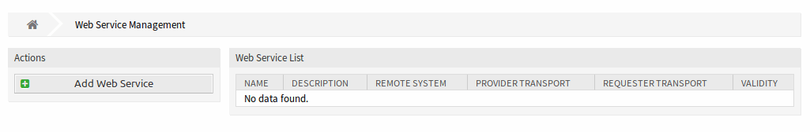

   Web Service Management Screen

Manage Web Services
-------------------

To create a web service:

1. Click on the *Add Web Service* button in the left sidebar.
2. Fill-in the required fields.
3. Click on the *Save* button.

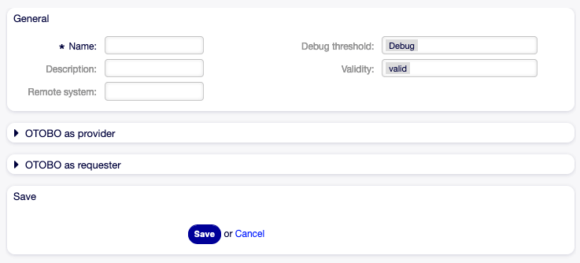

   Create New Web Service Screen

To edit a web service:

1. Click on a web service in the list of web services.
2. Modify the fields.
3. Click on the *Save* or *Save and finish* button.

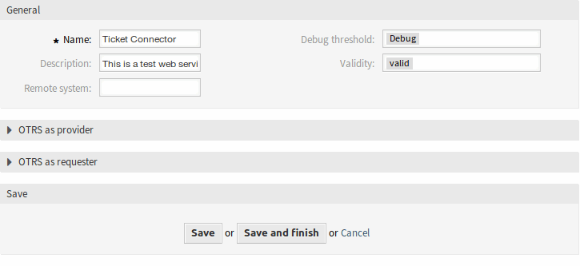

   Edit Web Service Screen

To delete a web service:

1. Click on a web service in the list of web services.
2. Click on the *Delete Web Service* button in the left sidebar.
3. Click on the *Delete* button in the confirmation dialog.

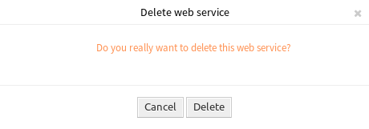

   Delete Web Service Screen

To clone a web service:

1. Click on a web service in the list of web services.
2. Click on the *Clone Web Service* button in the left sidebar.
3. Enter a new name for the web service.

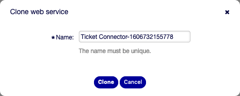

   Clone Web Service Screen

To export a web service:

1. Click on a web service in the list of web services.
2. Click on the *Export Web Service* button in the left sidebar.
3. Choose a location in your computer to save the ``Export_ACL.yml`` file to.

.. warning::

   All stored passwords in the web service configuration will be exported in plain text format.

To see the configuration history of a web service:

1. Click on a web service in the list of web services.
2. Click on the *Configuration History* button in the left sidebar.

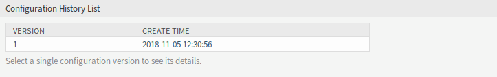

   Web Service Configuration History Screen

To use the debugger for a web service:

1. Click on a web service in the list of web services.
2. Click on the *Debugger* button in the left sidebar.

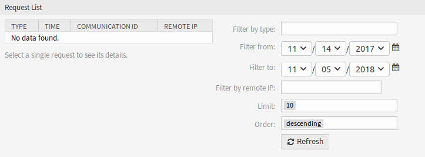

   Web Service Debugger Screen

To import a web service:

1. Click on the *Add Web Service* button in the left sidebar.
2. Click on the *Import Web Service* button in the left sidebar.
3. Click on the *Browse…* button in the dialog.
4. Select a previously exported ``.yml`` file.
5. Add a name for the imported web service (optional). Otherwise the name will be taken from the configuration file name.
6. Click on the *Import* button.

Web Service Settings
--------------------

The following settings are available when adding or editing this resource. The fields marked with an asterisk are mandatory.

General Web Service Settings
~~~~~~~~~~~~~~~~~~~~~~~~~~~~

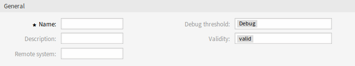

   Web Service Settings - General

Name \*
   The name of this resource. Any type of characters can be entered to this field including uppercase letters and spaces. The name will be displayed in the overview table.

Description
   Like comment, but longer text can be added here.

Remote system
   .. TODO: what is this?

Debug threshold
   The default value is *Debug*. When configured in this manner, all communication logs are registered in the database. Each subsequent debug threshold value is more restrictive and discards communication logs of lower order than the one set in the system.

   Debug threshold levels (from lower to upper):

   - Debug
   - Info
   - Notice
   - Error

Validity
   Set the validity of this resource. Resources can only be used in OTOBO if this field is set to *valid*. Setting this field to *invalid* or *invalid-temporarily* will disable the use of the resource.

Provider Web Service Settings
~~~~~~~~~~~~~~~~~~~~~~~~~~~~~

   .. note::
   
      To access the otobo webservice, please use the following URL:
      https://SERVERADDRESS/otobo/nph-genericinterface.pl/Webservice/WEBSERVICENAME/OPERATION

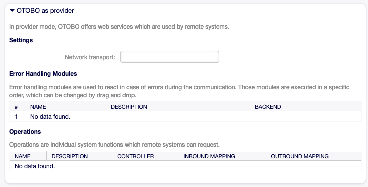

   Web Service Settings - OTOBO as Provider

Network transport
   Select which network transport you would like to use with the web service. Possible values are *HTTP::REST* and *HTTP::SOAP*.

   .. note::

      After selecting the transport method, you have to save the configuration by clicking on the *Save* button. A *Configuration* button will be displayed next to this field.

Configuration
   The *Configuration* button is visible only after a network transport was selected and saved. See the configuration for *OTOBO as Provider - HTTP\:\:REST* and *OTOBO as Provider - HTTP\:\:SOAP* below.

Add Operation
   This option is visible only after a network transport was selected and saved. Selecting an operation will open a new screen for configuration.

   .. figure:: images/web-service-add-operation.png
      :alt: Web Service Settings - OTOBO as Provider - Operation

      Web Service Settings - OTOBO as Provider - Operation

OTOBO as Provider - HTTP\:\:REST
^^^^^^^^^^^^^^^^^^^^^^^^^^^^^^^

To use the OTOBO REST interface, choose the network transport method "HTTP\:\:REST".
Save and reload the screen to load the ticket operations.

.. figure:: images/web-service-add-provider-rest-operations.png
   :alt: Web Service Settings - OTOBO as Provider - HTTP\:\:REST

   Web Service Settings - OTOBO as Provider - HTTP\:\:REST

You should now be able to select an operation. 

Operations
~~~~~~~~~~

There are different Ticket Operations which all serve a specific job:

- `Ticket::TicketCreate`
- `Ticket::TicketGet`
- `Ticket::TicketSearch`
- `Ticket::TicketUpdate`
- `Ticket::TicketHistoryGet`

In this example, we are going to use the Ticket::TicketCreate operation. Click on "Add Operation" and choose the "Ticket::TicketCreate" operation.
Choose a descriptive name, save the operation and go back to the webservice overview.

You now should see a new entry "Route mapping for Operation 'TicketCreate'".
Enter for example "/TicketCreate"

This will define the route, which will translate to:
``https://YOURSERVER/otobo/nph-genericinterface.pl/Webservice/<WEBSERVICE_NAME>/TicketCreate`` 

Click "Save and finish".

Now you can send a request to the endpoint. 

Here is an example using curl:

 .. code-block :: 

	curl -X POST --header "Content-Type: application/json"  
	--data '{
		"UserLogin": "AgentUser", 
		"Password": "Password",
		"Ticket": {
			"Title": "created by Webservice request",
			"QueueID":5, 
			"CustomerUser": "CustomerUser",
			"State": "new",
			"PriorityID": 1
		}, 
		"Article": {
			"CommunicationChannel": "Email",
			"From": "test@test.de", 
			"Subject": "Webservice Create Example",
			"Body": "This was created by a Webservice request!", 
			"ContentType": "text/html charset=utf-8"
		}
	}'
	https://YOURSERVER/otobo/nph-genericinterface.pl/Webservice/<WEBSERVICE_NAME>/TicketCreate

This request is using the least amount of attributes needed to create a new Ticket.

A full list of all attributes needed for operations can be found here: 
 - TicketCreate: https://github.com/RotherOSS/otobo/blob/rel-10_1/Kernel/GenericInterface/Operation/Ticket/TicketCreate.pm#L70
 - TicketGet: https://github.com/RotherOSS/otobo/blob/rel-10_1/Kernel/GenericInterface/Operation/Ticket/TicketGet.pm#L70
 - TicketUpdate: https://github.com/RotherOSS/otobo/blob/rel-10_1/Kernel/GenericInterface/Operation/Ticket/TicketUpdate.pm#L70
 - TicketSearch: https://github.com/RotherOSS/otobo/blob/rel-10_1/Kernel/GenericInterface/Operation/Ticket/TicketSearch.pm#L70
 - TicketHistoryGet: https://github.com/RotherOSS/otobo/blob/rel-10_1/Kernel/GenericInterface/Operation/Ticket/TicketHistoryGet.pm#L70

XLST-Mapping for OTOBO as Provider - HTTP\:\:REST
~~~~~~~~~~~~~~~~~~~~~~~~~~~~~~~~~~~~~~~~~~~~~~~~~

The XLST standard can be used to transform XML, JSON and CSV data.

In this example, we are going to use the XLST mapping to transform the response from the webservice into Dynamic Fields.

Create a Dynamic Field of Type Ticket->Text and name it for example "RemoteTicketID".

Given the incoming data: 
   .. code-block ::
   
   { "incidentID" : "12345", "incidentTitle" : "Test Ticket" }

We can save the data in the Dynamic Field as follows:
   .. code-block ::
   
   <example code here>
   
   
OTOBO as Provider - HTTP\:\:SOAP
^^^^^^^^^^^^^^^^^^^^^^^^^^^^^^^^

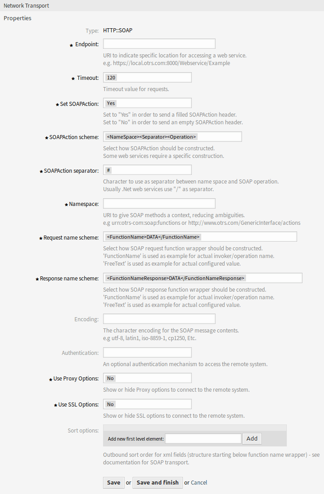

   Web Service Settings - OTOBO as Provider - HTTP\:\:SOAP

Requester Web Service Settings
~~~~~~~~~~~~~~~~~~~~~~~~~~~~~~

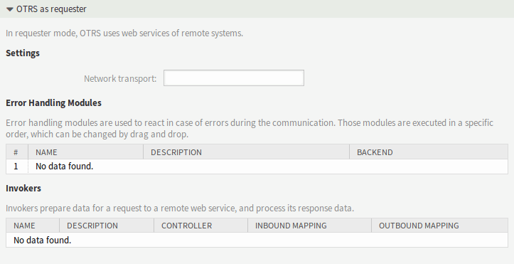

   Web Service Settings - OTOBO as Requester

Network transport
   Select which network transport would you like to use with the web service. Possible values are *HTTP::REST* and *HTTP::SOAP*.

   .. note::

      After selecting the transport method, you have to save the configuration by clicking the *Save* button. A *Configuration* button will be displayed next to this field.

Configuration
   The *Configuration* button is visible only after a network transport was selected and saved. See the configuration for *OTOBO as Requester - HTTP\:\:REST* and *OTOBO as Requester - HTTP\:\:SOAP* below.

Add error handling module
   This option is visible only after a network transport was selected and saved. Selecting an operation will open a new screen for its configuration.

   .. figure:: images/web-service-add-error-handling-module.png
      :alt: Web Service Settings - OTOBO as Provider - Error Handling Module

      Web Service Settings - OTOBO as Provider - Error Handling Module

OTOBO as Requester - HTTP\:\:REST
^^^^^^^^^^^^^^^^^^^^^^^^^^^^^^^^

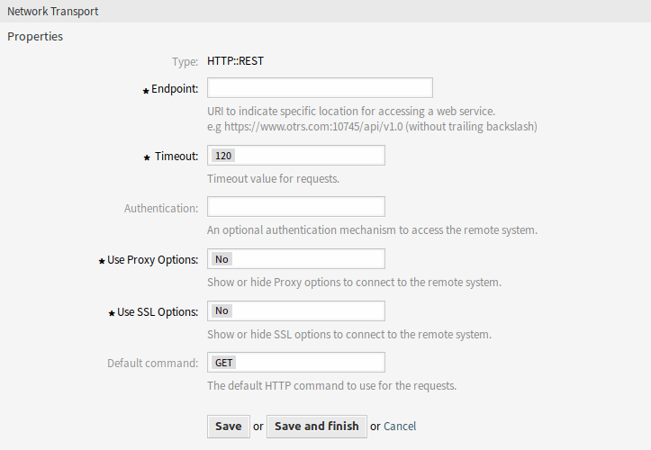

   Web Service Settings - OTOBO as Requester - HTTP\:\:REST

OTOBO as Requester - HTTP\:\:SOAP
^^^^^^^^^^^^^^^^^^^^^^^^^^^^^^^^

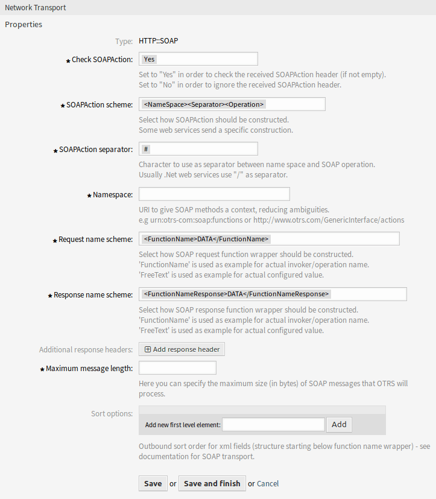

   Web Service Settings - OTOBO as Requester - HTTP\:\:SOAP
